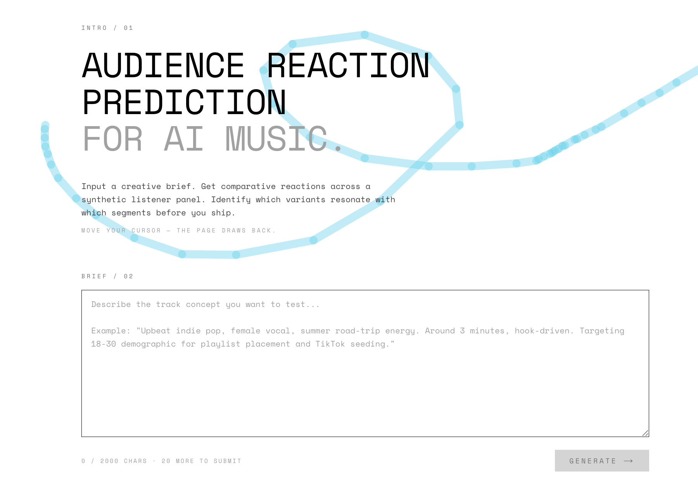

# Resonance

**Comparative audience reaction prediction for AI-generated music. Built in Next.js, powered by Claude.**

[**▶ Live demo**](https://resonance-ruddy.vercel.app/results/run_2f05a395-8490-471c-9f45-1ec5522e4783) · [Sample synthesis](#sample-output) · [How it works](#what-this-is)



---

## Sample output

The output below was generated from a single brief — *"Female vocal Latin trap with a hook in Spanglish. Under 2 minutes, designed for TikTok virality with a danceable drop"* — through the full pipeline: 5 track variants × 6 synthetic listener personas × 30 reactions × 1 Opus-generated synthesis.

> Variant C is the strongest candidate to advance, and the win is decisive (0.57 ahead of the next tier) — it's the only variant where every persona scored 7+ on saveworthiness, meaning it cleared both the creator-utility bar (Itzel, Yareli, Dariangel) and the cultural-credibility bar (Renata, Camilo) that usually split this kind of brief. The cumbia-trap polyrhythm is doing the rare double-duty of feeling sonically distinct in the first 20 seconds AND prescribing a specific dance motion, which is exactly what the TikTok use case requires.
>
> Recommended next test: produce a finished mix of Variant C with verified runtime under 2:00 and confirm the accordion stab recurs structurally rather than appearing as a one-shot — multiple personas flagged this specific risk and it would collapse the authenticity read if mishandled. **Hold Variant E** for an artist-development conversation rather than a viral push; its advocates are real but its failure mode (sounds broken on consumer speakers) is a structural ceiling, not a mixing fix.
>
> Treat all of this as **directional, not predictive** — synthetic personas can surface concept-level signal and divergence patterns, but actual TikTok engagement, sound-on-sound saturation, and creator adoption curves require a real-audience test before any distribution commitment.

Two more synthesized outputs from different briefs (lo-fi hip hop, dark synthwave) with full reaction data are in [`/examples`](examples/).

---

## What this is

Resonance is a tool for AI music studios that need to triage AI-generated track variants before committing to distribution. The workflow it addresses: a producer generates 5–10 candidate variants for a single creative brief, and needs to know which one to ship — or whether all of them have a problem the brief didn't catch.

Real-platform A/B testing is expensive (Spotify ad budget, YouTube channel reputation, TikTok creator fatigue). Synthetic-persona reaction prediction is cheap, fast, and directionally useful for the *first* triage step.

The pipeline:

1. **Parse a creative brief** into structured attributes (genre, mood, target use case, target demographic).
2. **Generate 5 distinct track variants** that span meaningful production decisions — hook structure, instrumental palette, vocal treatment, density. Each variant is described in sensory detail rather than producer terms, with an opinionated identity title (e.g. *THE CUMBIA FLIP*, *THE EMPTY LIBRARY*).
3. **Build a 6-persona synthetic listener panel** calibrated to the brief's target audience. Personas differ on listening context, discovery channel, engagement depth, and genre relationship — not just demographics. Two of six are deliberately at the *edge* of the target audience to surface where the variant breaks down.
4. **Run 30 parallel reactions** (6 personas × 5 variants), each producing a structured score, a qualitative reaction in the persona's voice, and transmission scores predicting which other panel members each persona would recommend the variant to.
5. **Synthesize** — aggregate the 30 reactions into a structured recommendation: top variant overall, top variant per audience segment, polarized variants worth investigating, and one concrete A&R recommendation with honest scope bounds.

Full pipeline runs in 3–4 minutes per brief. Output is rendered in an interactive dashboard with a clickable reaction matrix, segment-aware synthesis cards, and a social transmission graph showing predicted recommendation paths between panel members.

---

## What it gets right, what it doesn't

**What it gets right:**

- **Comparative reaction signal.** When two personas disagree about a variant, the tool surfaces the disagreement and explains what it reveals. Synthesis output regularly identifies structural insights (e.g. "this is a foreground track miscategorized as study music") rather than just averaging scores.
- **Persona authenticity.** Personas are written with opinionated negative-reaction triggers — most LLM persona generators produce diversity-of-positive-traits, which produces homogeneous reactions. The persona prompt explicitly engineers for divergence, including bilingual reactions where the brief targets multilingual audiences (the showcase run produces reactions in Spanglish from Itzel, Yareli, Dariangel, Camilo).
- **Honest scope.** Synthesis output explicitly bounds its claims as directional, not predictive. The tool refuses to predict virality.

**What it doesn't:**

- **Virality prediction.** Real virality depends on platform algorithms, network effects, and randomness — none of which a synthetic panel models. Transmission scores capture *one persona's model of another persona's preferences*, not actual recommendation behavior at scale.
- **Audio analysis.** Variants are described, not generated. The system reasons about what a track *would sound like* from production specs, not actual audio. A production version would integrate audio embeddings (CLAP, MERT) for direct similarity analysis.
- **Calibration.** Synthetic personas aren't calibrated against real platform engagement data. The most direct production extension would be calibrating persona reactions against an internal corpus of "track X performed Y on Spotify within demographic Z" data.

---

## Tech & research lineage

**Stack:** Next.js 16 (App Router) · TypeScript · Tailwind v4 · Upstash Redis (KV) via Vercel Marketplace · Anthropic Claude API · deployed on Vercel.

**Models:** Claude Sonnet 4.6 for high-volume creative generation (variants, personas, 30 reactions); Claude Opus 4.7 for synthesis (one call per run, where reasoning quality matters most).

**Architecture:** The brief-submission endpoint runs the entire pipeline inline within Next.js's `after()` callback, so the user gets a `runId` in <5s and the rest of the pipeline (variants → personas → reactions → synthesis) executes inside a single Vercel function instance. Reactions are orchestrated through [`p-limit`](https://github.com/sindresorhus/p-limit) with concurrency=6 and per-call retry on JSON-parse or schema-mismatch failures, tolerating up to 3 reaction failures out of 30 before aborting the run. The frontend polls run state every 2 seconds and progressively renders artifacts as each stage completes.

**Built primarily with [Claude Code](https://www.anthropic.com/claude-code)** as the development workflow. Most of the codebase was written through prompt iteration in Claude Code rather than from scratch.

**Research lineage:** The persona-panel approach is informed by recent work on LLM-driven synthetic populations — Stanford's *Generative Agents: Interactive Simulacra of Human Behavior* (Park et al., 2023), which demonstrated emergent social behavior in LLM-powered agent populations, and MIT Media Lab's *Large Population Models* (Chopra et al., 2024) on calibrating agent-based simulations against real-world data streams. Resonance applies a deliberately smaller-N, higher-fidelity persona approach for content reaction prediction, where individual reasoning depth matters more than population scale. The transmission-score feature is inspired by LPM-style influence-network modeling, scaled down to a single-panel directed graph.

---

## Future extensions

Three directions for a production version, in rough priority order:

**1. Calibration against real engagement data.** Resonance personas are LLM-generated and uncalibrated. A production version would back personas with *empirical signal* — internal data on which demographic + listening-context combinations correlate with which track-feature combinations on actual platforms. The architecture is designed to support this: persona attributes (`favoriteGenres`, `listeningContexts`, `discoveryHabits`) map cleanly onto observed-engagement features.

**2. Audio embedding integration.** Variants are currently descriptive. A production version would generate or sample real audio for each variant and integrate audio embeddings (CLAP, MERT) into the reaction prompt. This would convert "imagined track based on description" into "track the persona actually reacts to" — much higher fidelity, but requires a generation backend.

**3. Cross-variant pattern detection.** Currently each run is independent. A production version would learn which *types* of production decisions cause which *types* of persona reactions across many runs, surfacing patterns like "variants with humanized-swing drum programming consistently lose functional listeners." This becomes a longitudinal A&R intelligence layer rather than a single-shot triage tool.

---

## Run locally

```bash
git clone https://github.com/marcebd/resonance
cd resonance
npm install

# Set up environment variables
cp .env.example .env.local
# Fill in: ANTHROPIC_API_KEY, KV_REST_API_URL, KV_REST_API_TOKEN

npm run dev
```

A single end-to-end run costs roughly $0.50 in Anthropic API credits (37 model calls, mostly Sonnet, one Opus). Upstash Redis free tier is sufficient for development.

---

*Built by Marcela Billingslea. [GitHub](https://github.com/marcebd) · [LinkedIn](https://linkedin.com/in/REPLACE-WITH-YOUR-HANDLE)*
